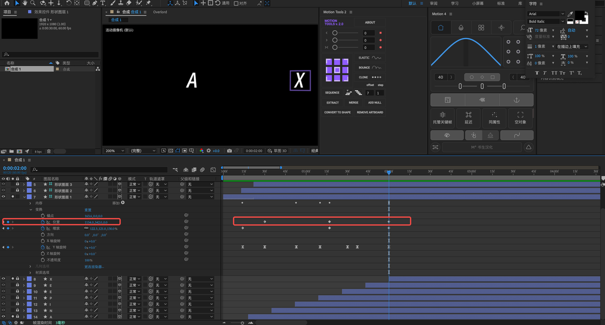

# 前言

最近，对「动效制作」这个话题非常感兴趣。在 C 端场景下，我最常接触到的动效就是 `Lottie`。 然而，作为一个前端开发，我发现自己只会把设计同学产出的 Lottie 文件直接拿过来塞到组件里，对于“动效制作”的过程完全不了解，对于设计同学常提的一些基础概念、以及他们遇到的痛点，没有直观的感受。

因此，萌生了自己上手学习一下 AE 动效制作的想法，尝试通过复刻 **A社 Logo 的动效**，在动手实践的过程中学习一下 **AE 软件的基础使用和动效制作的流程**，对整个过程做个简单的记录，也方便其他有这方面兴趣的同学参考和交流~

# 效果展示

# 动效制作教程

> 叠甲：尽管是希望能尽可能详细地告诉大家各个步骤如何操作，但是，由于环境/软件版本/插件版本/bug等等各种因素，实际操作起来肯定会发现有各种和我的截图/操作不一致的地方。所以，大家还是以自己的实际情况为准。
> 
> 参考视频：[【AE教程】纯代码！A社Lottie代码动画教学来了！纯AE制作，100%学会](https://www.bilibili.com/video/BV1GD4y1t7iF/?spm_id_from=333.788.top_right_bar_window_history.content.click&vd_source=02bbc3f645280cbc0614a51f34a87e94)

> 这个视频的实操部分讲的比较快，并且有大量细节丢失，**建议配合本篇教程食用效果更佳**）

## 环境搭建

制作软件：
- Adobe After Effects 2023
- Adobe  Illustrator 2023

插件： 
- Motion 4
- Motion Tools 2
- Overload 1.24

## 文字制作

首先，需要制作一个 ANIPLEX 的文字

### 方法一

在 Adobe Illustrator 中制作好矢量文字，然后通过 Overlord 插件推送到 AE 中

字体选一个你看着觉得最顺眼的斜体就行，文字刚出来的时候是在一个图层中的，我们**需要把每个字符弄成一个单独的图层**，方法是：选中文字图层，点击 属性 —> 快速操作 —> 创建轮廓

然后通过 Overlord 插件将所有文字图层推送到 AE 中（如果你不想用这个插件，直接保存这个 Illustrator 的项目，然后在 AE 中导入 .ai 文件也是一样的）

### 方法二

AE 中自己也是有文字工具的，整体制作流程应该和 AI 是一样一样的。所以，如果不想用 Illustrator，就直接在 AE 中编辑文字图层就完事儿了

## AE 动效制作

### 新建项目

首先新建一个项目，并新建一个合成层，帧速率设置成 60 fps

这里的合成层，个人理解是基础的影片片段，每个合成层有自己的时间轴。

### 文字旋转

通过刚才提到的 Overload 插件，将文字导入到 AE 中：

然后我们需要制作文字的旋转动画，选中图层后：

- 先按快捷键 [，将所有文字图层的开始帧对齐到第 18 帧

- 将所有文字图层转换成 3D 图层，然后再按快捷键 R，打开图层动画效果的 **旋转属性**。然后点击一下 Y轴旋转前面的小时钟按钮，表示给 Y轴旋转这个属性打上关键帧
    - 18 帧，259度
    - 2 秒 21 帧，y 轴旋转 -1 圈
    - 通过 Motion 4 插件，给 Y 轴旋转添加 40 的缓动动画

- 现在制作出来的字体旋转动画，整体旋转的时候是围绕整个图层的中心的

我们想要的是每个文字围绕各自的中心旋转的效果，因此，按下快捷键 Q，打开锚点工具，调整每个文字的锚点到自己的中心：

- 通过 Motion Tools 2 调整图层的帧偏移，让所有图层从下往上错开 17 帧，这样就出现了文字逐个出现并旋转的效果

- 继续使用 Motion Tools 2 工具，调整旋转动画依序列向后偏移 7 帧，然后让第一个文字的旋转动画的开始帧对齐；这样，旋转动画和文字的出现是有一个时间偏移的，呈错开的效果（不是同时出现、同时转的）

### 方块制作

通过快捷键 Q — 矩形工具，画一个方块、圈住文字。然后调整中间颜色为透明，调整描边宽度和颜色；同样需要转换为 3D 图层。

制作了一个方块，其他六个复制粘贴就行。

### 方块动画

**接着是个人认为比较难的一步**，需要给方块的位置和 Y 轴旋转添加关键帧，让他伴随着文字的出现移动，同时左右摆动。这里以 X 为例，演示一下步骤：

- **位移关键帧**：这个非常明显，从开始的 A 移动到最后 X 的位置，这里我设置的开始是 0 秒 30帧（记作: 0s 30f），过程中 1 s 15 帧，最终结束时 2 s 0 帧

- **Y 轴关键帧**：左右摆动是靠 Y 轴旋转完成的，如上图，不用完全一致，大致摆动的感觉对就行
    - 0s 15f: -260度
    - 0s 30f: 0度
    - 0s 50f: 130 度
    - 1s 8f: 40 度
    - 1s 30f：135 度
    - 1s 40f：145 度
    - 2s 0f：0 度
    

    
    
- **缩放关键帧**：整体有一个由小到大再变小的过程，所以看到简单打了三个关键帧， 120% —> 180% —> 120%

- **路径关键帧**：原先的方块变换，是一个比较简单的二维变换，**不太有透视的感觉。**为了模拟透视，手动在 Y 轴旋转的关键帧上，对矩形形状做一些矫正，让他看起来更像是透视。这里需要先把原来的矩形路径转换为“**贝塞尔曲线路径**”，这样才能自由调整矩形的顶点位置。

右键矩形路径，转换为贝塞尔曲线。视频中这样做后直接就能调整矩形的路径点了，但是实操下来发现，需要先“取消组合形状”，然后才能编辑，不知道是不是 AE 版本问题或者 Bug…

接下来需要在每个 Y轴旋转关键帧处调整透视，做一个人为的透视纠正

- **描边宽度关键帧**：描边宽度如果一直不变的话，在动画中间会显得比较粗，因此简单地加一个 粗 —> 细 —> 粗 的关键帧动画

最终整体的关键帧打点情况，供参考：

这样，我们就做好了一个方块的动画。其他六个方块复制后，调整对应的位置、旋转、出现时间这些动画即可（这一块我自己就真的全跟着感觉瞎XX调的，大致样子像即可）

# 后话

仔细看的话，最终效果上还是有不少缺陷：

- 方块的透视效果比较差，是用“路径”模拟出来的伪透视
- 各个方块的运动有些杂乱，旋转和摆动的节奏不和谐，尤其是最中间那个红色方块

原版 vs 我制作的山寨版:

原版：

山寨版：

~~未来会开成一个系列的坑吗？Maybe......~~